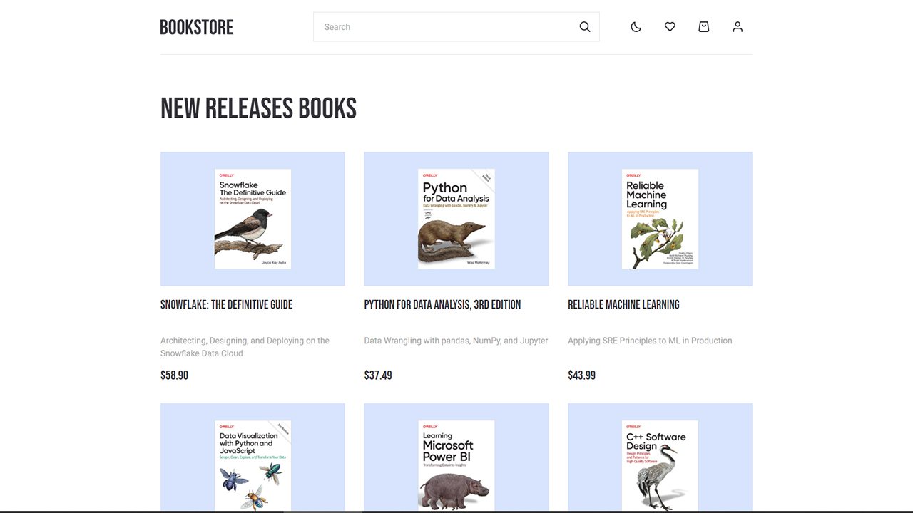
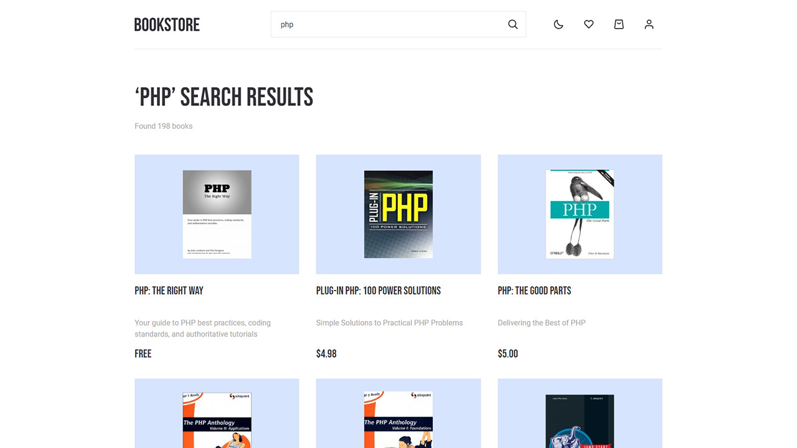
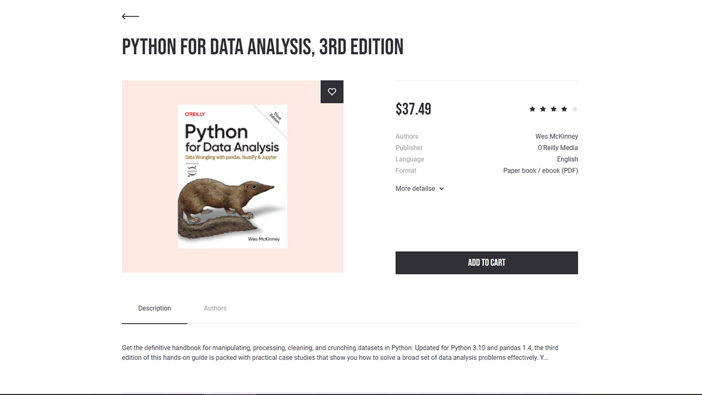
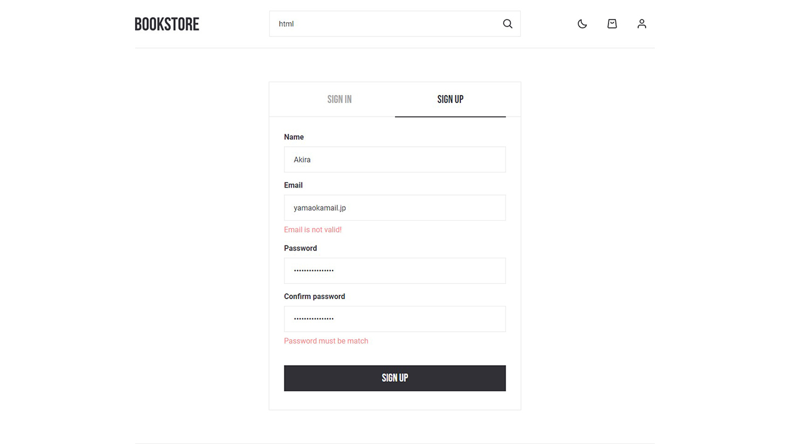
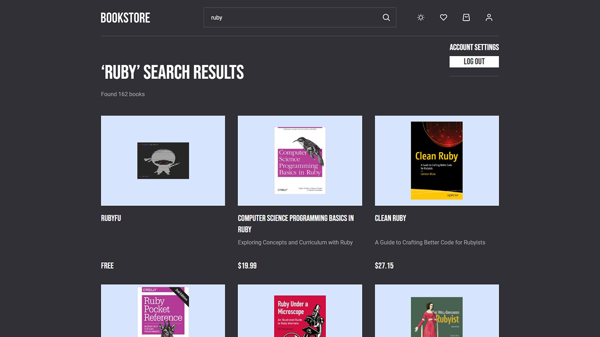

<a name="readme-top"></a>

<br />
<div align="center">
  <p align="center">
    

  </p>
</div>

<details>
  <summary>Навигация</summary>
  <ol>
    <li><a href="#about-the-project">О проекте</a></li>
    <li><a href="#built-with">Примененные технологии</a></li>
    <li><a href="#usage">Как пользоваться</a></li>
    <li><a href="#contact">Контакты</a></li>
  </ol>
</details>

## О проекте

<p>Добро пожаловать на репозиторий моего дипломного проекта, в рамках обучения в школе TeachMeSkills. Это книжный интернет магазин. Написан на React Typescrypt, с применением Redux Toolkit, React Router Dom и др. В проекте реализованы все основные функции интернет магазина.</p>
  <p align="center">
    <a href="https://yauhiry.github.io/bookstore/">Смотреть демо</a>
    <br>
  </p>

Домашняя страница с новинками в мире IT-литературы

<br>
<br>

Поиск книг по названию. Так же, реализована удобная навигация для переключения страниц.

<br>
<br>

Возможно изучить книгу детально, а при необходимости добавить в избранное, или корзину. Для незарегистрированных пользователей эти функции доступны лишь частично.

<br>
<br>

Регистрация по email выполнена с помощью базы Firebase. Все поля форм провалидированны, чтобы избежать ошибок.

<br>
<br>

Реализована смена тем. Приложение само проследит, какую тему предпочитает пользователь, но и есть возможность переключения.

<br>
<br>

Bookstore адаптирован под все современные устройства.

<p align="right">(<a href="#readme-top">наверх</a>)</p>

## Создано c помощью

- [![React][react.js]][react-url]
- [![Npm][npm.js]][npm-url]
- [![Styled-component][styled-component.com]][styled-component-url]
- [![Typescrypt][typescrypt.org]][typescrypt-url]
- [![React-hook-form][react-hook-form.com]][react-hook-form-url]
- [![Firebase][firebase.com]][firebase-url]
- [![Visualstudio][code.visualstudio.com]][code.visualstudio-url]
- [![Redux-toolkit][redux-toolkit.js.org]][redux-toolkit-url]
- [![Git][git-scm.com]][git-scm-url]

<p align="right">(<a href="#readme-top">наверх</a>)</p>

## Как использовать

Для того, чтобы установить проект локально, необходимо выполнить следующие шаги:

1. Клонировать репозиторий
   ```sh
   git clone https://github.com/Yauhiry/bookstore
   ```
2. Установить NPM пакеты
   ```sh
   npm install
   ```
3. Запустить проект
   ```sh
   npm start
   ```

<p align="right">(<a href="#readme-top">наверх</a>)</p>

## Контакты

Евгений Гиринский - yauhiry@gmail.com

Ссылка на проект: [https://github.com/Yauhiry/react-budget-app](https://github.com/Yauhiry/react-budget-app)

[![LinkedIn][linkedin-shield]][linkedin-url]

<p align="right">(<a href="#readme-top">наверх</a>)</p>

[linkedin-shield]: https://img.shields.io/badge/LinkedIn-0077B5?style=for-the-badge&logo=linkedin&logoColor=white
[linkedin-url]: https://www.linkedin.com/in/yauheni-hirynski-86b454262/
[product-screenshot]: images/budget-app.png
[npm.js]: https://img.shields.io/badge/npm-CB3837?style=for-the-badge&logo=npm&logoColor=white
[npm-url]: https://www.npmjs.com/
[react.js]: https://img.shields.io/badge/React-20232A?style=for-the-badge&logo=react&logoColor=61DAFB
[react-url]: https://reactjs.org/
[styled-component.com]: https://img.shields.io/badge/styled--components-DB7093?style=for-the-badge&logo=styled-components&logoColor=white
[styled-component-url]: https://styled-components.com/
[typescrypt.org]: https://img.shields.io/badge/TypeScript-007ACC?style=for-the-badge&logo=typescript&logoColor=white
[typescrypt-url]: https://www.typescriptlang.org/
[react-hook-form.com]: https://img.shields.io/badge/React%20Hook%20Form-%23EC5990.svg?style=for-the-badge&logo=reacthookform&logoColor=white
[react-hook-form-url]: https://react-hook-form.com/
[firebase.com]: https://img.shields.io/badge/firebase-ffca28?style=for-the-badge&logo=firebase&logoColor=black
[firebase-url]: https://firebase.google.com/
[code.visualstudio.com]: https://img.shields.io/badge/Visual_Studio_Code-0078D4?style=for-the-badge&logo=visual%20studio%20code&logoColor=white
[code.visualstudio-url]: https://code.visualstudio.com/
[redux-toolkit.js.org]: https://img.shields.io/badge/redux-%23593d88.svg?style=for-the-badge&logo=redux&logoColor=white
[redux-toolkit-url]: https://redux-toolkit.js.org/
[git-scm.com]: https://img.shields.io/badge/git-%23F05033.svg?style=for-the-badge&logo=git&logoColor=white
[git-scm-url]: https://git-scm.com/
